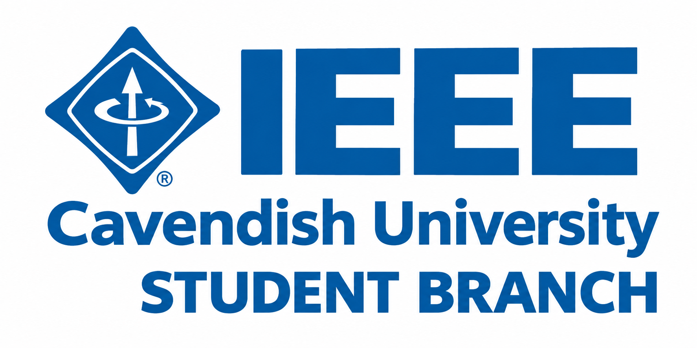

<p align="center">
  
</p>

# IEEE Student Branch — Cavendish University Uganda

Official website for the **IEEE Student Branch at Cavendish University Uganda (CUU)**, showcasing the Branch launch & IEEE Day, IEEEXtreme competition, ambassador programs, technical communities, student membership, and the Branch leadership team.

Built with **Next.js 14 (App Router)**, **TypeScript**, and **Tailwind CSS**.

---

## Table of Contents

1. [Features](#features)
2. [Quick Start](#quick-start)
3. [Network & Package Installation Note](#network--package-installation-note)
4. [Project Structure](#project-structure)
5. [Page Sections & Components](#page-sections--components)
6. [Updating Content & Data](#updating-content--data)
7. [Design System & Styling](#design-system--styling)
8. [Known Development Notices](#known-development-notices)
9. [Pre-Deployment Checklist](#pre-deployment-checklist)
10. [Deployment Guide](#deployment-guide)
11. [Tech Stack](#tech-stack)

---

## Features

- 🌌 **Custom Cyberpunk/Dark UI**: Glassmorphic cards, gradient meshes, animated orbital ring graphic, and subtle ambient glows.
- ⏱️ **Live Countdown Timers**: Real-time client countdowns for IEEE Day 2026 and IEEEXtreme deadlines.
- 📱 **Fully Responsive**: Mobile-first design with smooth collapsible drawer navigation and responsive grid layouts.
- 🚀 **Next.js 14 App Router**: Server-side rendering, layout optimization, and SEO metadata preconfigured.
- ♿ **Motion Accessibility**: Built-in support for `prefers-reduced-motion` to tone down animations automatically.
- 🎯 **Single Data Hub**: All text copy, FAQs, timeline milestones, external links, and leadership profiles are organized in a single configuration file (`lib/data.ts`).

---

## Quick Start

### Prerequisites
- **Node.js**: v18.17.0+ or v20+ recommended (Node v24 supported with `--legacy-peer-deps`)
- **npm** or **pnpm**

### Installation & Run

```bash
# 1. Install dependencies
npm install --legacy-peer-deps

# 2. Run the development server
npm run dev
```

Open [http://localhost:3000](http://localhost:3000) in your browser.

---

## Network & Package Installation Note

If you experience `ECONNRESET` or download timeouts while running `npm install` on restrictive networks or local firewalls, install using the Cloudflare/Alibaba-backed global mirror:

```bash
# Install using the mirror registry
npm install --legacy-peer-deps --registry https://registry.npmmirror.com
```

Or set it globally:
```bash
npm config set registry https://registry.npmmirror.com
```

---

## Project Structure

```text
d:\IEEE\
├── app/
│   ├── layout.tsx          # Root layout: metadata, fonts, body wrapper
│   ├── page.tsx            # Main one-page site assembling all sections
│   └── globals.css         # Tailwind base layers, glass tokens & custom utilities
│
├── components/
│   ├── SiteHeader.tsx      # Sticky navigation bar with announcement ticker & mobile menu
│   ├── Hero.tsx            # Hero section with animated orbital graphic and primary CTAs
│   ├── WhatIsIEEE.tsx      # Core pillars (Technology, Research, Leadership, Global)
│   ├── Journey.tsx         # 6-step member onboarding pathway
│   ├── EventSpotlight.tsx  # IEEE Day feature spotlight with live countdown clock
│   ├── IEEExtreme.tsx      # 24-hour virtual programming competition showcase
│   ├── Programs.tsx        # Ambassador programs (AWS Builders, Black Python Devs, GitHub)
│   ├── Communities.tsx     # IEEE Technical Societies directory
│   ├── Membership.tsx      # Membership grade overview table
│   ├── Team.tsx            # Executive committee roster cards
│   ├── Faq.tsx             # Frequently asked questions
│   ├── Resources.tsx       # Quick links to official IEEE portals
│   ├── JoinBanner.tsx      # Call-to-action banner for joining the branch community
│   ├── SiteFooter.tsx      # Multi-column footer and copyright
│   ├── SectionHead.tsx     # Reusable section kicker, title, and body layout
│   ├── Ticker.tsx          # Continuous scrolling announcement marquee
│   └── ui/
│       └── Countdown.tsx   # Reusable countdown timer component
│
├── lib/
│   ├── data.ts             # Central data source: copy, dates, links, team roster, FAQ
│   └── useCountdown.ts     # Client hook calculating remaining days/hours/mins/secs
│
├── public/
│   └── favicon.svg         # IEEE CUU SVG favicon
│
├── tailwind.config.ts      # Tailwind configuration with custom theme colors & keyframes
├── next.config.mjs         # Next.js configuration
├── tsconfig.json           # TypeScript path mappings (@/*)
└── package.json
```

---

## Page Sections & Components

| Component | Anchor ID | Purpose |
| :--- | :--- | :--- |
| **SiteHeader** | — | Sticky branding, navigation anchors, live ticker, and mobile menu |
| **Hero** | `#top` | Headline, mission statement, primary CTAs, and dynamic orbit visualization |
| **WhatIsIEEE** | `#about` | Four core pillars of IEEE membership and engagement |
| **Journey** | `#branch` | Six steps from learning and joining to building and connecting |
| **EventSpotlight** | `#event` | Details and countdown for IEEE Day / Branch launch |
| **IEEExtreme** | `#xtreme` | Global 24-hour competitive programming challenge details |
| **Programs** | `#programs` | Campus ambassador programs (AWS, GitHub, Python communities) |
| **Communities** | `#communities` | Technical societies (Computer Society, ComSoc, Robotics, etc.) |
| **Membership** | `#membership` | Breakdown of student, graduate, and professional membership grades |
| **Team** | `#team` | Executive committee officer profiles |
| **Faq** | `#faq` | Common questions about eligibility and interdisciplinary participation |
| **Resources** | — | Curated list of direct links to IEEE portals and standards |
| **JoinBanner** | `#join` | Direct action banner to connect with the student community |
| **SiteFooter** | — | Navigation columns, legal info, and external IEEE links |

---

## Updating Content & Data

All website copy and dynamic links are centralized in [`lib/data.ts`](file:///d:/IEEE/lib/data.ts).

### 1. Update Registration and WhatsApp Links
```typescript
// lib/data.ts
export const WHATSAPP_INVITE_URL = "https://chat.whatsapp.com/YOUR_ACTUAL_GROUP_INVITE";
export const IEEE_DAY_REGISTRATION_URL = "https://forms.gle/YOUR_REGISTRATION_FORM";
```

### 2. Update Countdown Dates
Dates must be ISO-8601 strings:
```typescript
// lib/data.ts
export const IEEE_DAY_TARGET_ISO = "2026-10-06T09:00:00+03:00";
export const IEEEXTREME_DEADLINE_ISO = "2026-10-17T23:59:00Z";
```

### 3. Update the Executive Committee
```typescript
// lib/data.ts
export const team = [
  { name: "Mulondo Andrew", role: "Chair" },
  { name: "Basiima Nicholas", role: "General Secretary" },
  // add or update members...
];
```

### 4. Edit Announcements
To update the top banner message, edit [`components/Ticker.tsx`](file:///d:/IEEE/components/Ticker.tsx).

---

## Design System & Styling

### Color Palette
Defined in [`tailwind.config.ts`](file:///d:/IEEE/tailwind.config.ts):

- **Background & Surfaces**:
  - `bg`: `#070A16` (Deep cosmic navy)
  - `surface`: `#0E1328`
  - `surface2`: `#151B38`
  - `surface3`: `#1C2447`
  - `line`: `#252C4E`
- **Accents**:
  - `violet`: `#7C5CFF` (Primary brand accent)
  - `cyan`: `#2FD8E5` (High-tech accent)
  - `ember`: `#FF7A45` (Call-to-action & warm accent)
  - `mint`: `#7CFFC4` (Fresh contrast accent)

### Typography
- **Headings**: Sora (`--font-sora`, Google Font)
- **Body**: IBM Plex Sans (`--font-plex`, Google Font)

### Custom CSS Classes
Found in [`app/globals.css`](file:///d:/IEEE/app/globals.css):
- `.glass`: Translucent surface with backdrop blur and border glow.
- `.gradient-text`: Violet-to-cyan-to-mint gradient clip.
- `.gradient-text-warm`: Peach-to-ember gradient clip.

---

## Known Development Notices

- **Google Fonts Offline Fallback**: If building without an active internet connection or behind a restrictive proxy, Next.js will fall back to system sans-serif fonts automatically without breaking the layout.
- **Service Worker 404 (`/sw.js`)**: If your browser extensions look for a service worker, you may notice benign 404 messages in terminal logs. The app does not require a service worker.

---

## Pre-Deployment Checklist

Before publishing to production:
- [ ] Replace `WHATSAPP_INVITE_URL` in `lib/data.ts` with the official link.
- [ ] Replace `IEEE_DAY_REGISTRATION_URL` in `lib/data.ts` with the official Google Form or Eventbrite link.
- [ ] Verify event dates and timezones (`IEEE_DAY_TARGET_ISO`).
- [ ] Confirm Executive Committee names and roles in `team`.
- [ ] Run a test build to ensure no TypeScript or compilation errors:
  ```bash
  npm run build
  ```

---

## Deployment Guide

### Deploy to Vercel (Recommended)
1. Push your repository to GitHub / GitLab / Bitbucket.
2. Import the repository into [Vercel](https://vercel.com).
3. Vercel automatically detects Next.js:
   - **Framework Preset**: Next.js
   - **Build Command**: `next build`
   - **Output Directory**: `.next`
4. Click **Deploy**.

### Self-Hosted / Node.js Server
```bash
# Build the application
npm run build

# Start the production server on port 3000
npm run start
```
Configure Nginx, Caddy, or Cloudflare Tunnel as a reverse proxy pointing to `http://localhost:3000`.

---

## Tech Stack

- **Framework**: [Next.js 14](https://nextjs.org/) (App Router)
- **Language**: [TypeScript](https://www.typescriptlang.org/)
- **Styling**: [Tailwind CSS](https://tailwindcss.com/)
- **Icons**: [Lucide React](https://lucide.dev/)
- **Fonts**: [Google Fonts (Sora & IBM Plex Sans)](https://fonts.google.com/)
