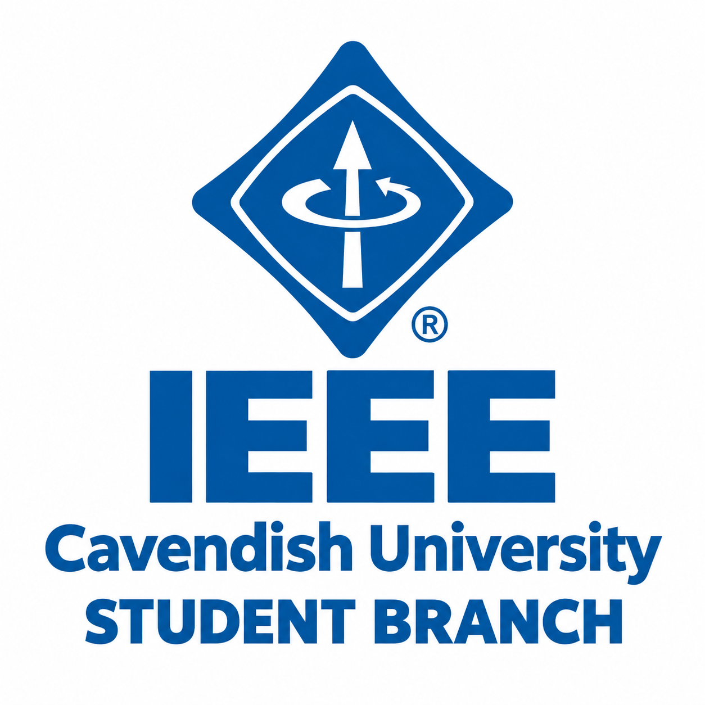

<p align="center">
  
</p>

# IEEE Student Branch — Cavendish University Uganda

This project is the official website for the IEEE Student Branch at Cavendish University Uganda. It is designed to help students, visitors, and partners understand who the branch is, what it does, how to join, and how to take part in branch events such as IEEE Day and IEEEXtreme.

The site is built with Next.js, TypeScript, and Tailwind CSS. It has a modern, readable design, responsive mobile navigation, event countdowns, and real social/community links that can be updated from environment variables.

---

## What this site does

For a simple person, this website is the branch’s digital front door. It explains:

- what IEEE is
- what the branch does at Cavendish University Uganda
- upcoming events and registration links
- how to join or connect with the branch
- who the student leaders are
- official community and social channels

For a developer, this project is a multi-page Next.js app with shared components, centralized content data, and environment-based configuration for links and registration URLs.

---

## Project overview

This app includes:

- a landing page with a slideshow hero section and call-to-action buttons
- a branch overview page
- a CUUCSA page
- an events page with IEEE Day and IEEEXtreme sections
- a join page and contact/community pathway
- a team page and programs overview
- a footer and floating WhatsApp button for quick access

---

## Tech stack

- [Next.js 14](https://nextjs.org/)
- [React 18](https://react.dev/)
- [TypeScript](https://www.typescriptlang.org/)
- [Tailwind CSS](https://tailwindcss.com/)
- [Lucide React](https://lucide.dev/)

---

## Quick start

### Prerequisites

- Node.js 18 or later
- npm

### Install dependencies

```bash
npm install
```

### Start the app in development mode

```bash
npm run dev -- --hostname 0.0.0.0
```

Then open:

- http://localhost:3000

### Create a production build

```bash
npm run build
```

### Start the production build locally

```bash
npm run start -- --hostname 0.0.0.0
```

---

## Environment variables

This project uses a root [.env](.env) file for social and registration links. These values are read in [lib/data.ts](lib/data.ts) and then reused across the site.

Example values in the current project:

```env
# IEEE social links
NEXT_PUBLIC_IEEE_LINKEDIN_URL=https://www.linkedin.com/company/ieee-cavendish-university-student-branch/
NEXT_PUBLIC_IEEE_X_URL=https://x.com/IEEECavendish
NEXT_PUBLIC_IEEE_TIKTOK_URL=https://www.tiktok.com/@cavendishieee?_r=1&_t=ZS-9A3Zys0H1r2
NEXT_PUBLIC_IEEE_WHATSAPP_URL=https://chat.whatsapp.com/D14xEzlcP9bF4JKXnAiMU8

# Event and community links
NEXT_PUBLIC_IEEE_EVENT_REGISTRATION_URL=https://forms.gle/oNnnQLsjNv4WWg1L9
NEXT_PUBLIC_CUUCSA_LINKEDIN_URL=https://www.linkedin.com/company/cavendish-university-uganda-computing-students-association/
NEXT_PUBLIC_CUUCSA_WHATSAPP_URL=https://chat.whatsapp.com/JRmTgNpDhRSLVOBPoIDj5W
```

Important:

- Replace any placeholder or outdated link with the real one before publishing.
- Do not hardcode social links inside components when they can be managed from the environment file.

---

## Main project structure

```text
IEEE/
├── app/
│   ├── about/
│   ├── branch/
│   ├── cuucsa/
│   ├── events/
│   ├── join/
│   ├── programs/
│   ├── team/
│   ├── globals.css
│   ├── layout.tsx
│   └── page.tsx
├── components/
│   ├── SiteHeader.tsx
│   ├── Hero.tsx
│   ├── EventSpotlight.tsx
│   ├── IEEExtreme.tsx
│   ├── CUUCSA.tsx
│   ├── SiteFooter.tsx
│   ├── Partnerships.tsx
│   ├── Resources.tsx
│   ├── Faq.tsx
│   ├── Team.tsx
│   └── ui/
│       └── Countdown.tsx
├── lib/
│   ├── data.ts
│   └── useCountdown.ts
├── public/
│   ├── images/
│   └── favicon.svg
├── .env
├── .gitignore
├── next.config.mjs
├── package.json
├── postcss.config.mjs
├── tailwind.config.ts
├── tsconfig.json
├── README.md
└── next-env.d.ts
```

---

## Where content lives

### Social and event links

All key external URLs are managed in [lib/data.ts](lib/data.ts). This includes:

- IEEE WhatsApp link
- event registration link
- CUUCSA WhatsApp link
- CUUCSA LinkedIn link
- IEEE social media URLs

### Page content and data

The site uses reusable data objects for content such as:

- events
- FAQs
- team members
- student programs
- program and societies information

This makes it easier to update content without changing layout code everywhere.

---

## How the site works

### Front-end flow

1. The root layout in [app/layout.tsx](app/layout.tsx) wraps all pages.
2. Each route under [app](app) renders specific sections.
3. Shared components such as [components/SiteHeader.tsx](components/SiteHeader.tsx) and [components/SiteFooter.tsx](components/SiteFooter.tsx) are reused across pages.
4. The homepage is assembled in [app/page.tsx](app/page.tsx).
5. Event countdowns use the timer from [components/ui/Countdown.tsx](components/ui/Countdown.tsx).

### Main page routes

- Home: [app/page.tsx](app/page.tsx)
- About: [app/about/page.tsx](app/about/page.tsx)
- Branch: [app/branch/page.tsx](app/branch/page.tsx)
- CUUCSA: [app/cuucsa/page.tsx](app/cuucsa/page.tsx)
- Events: [app/events/page.tsx](app/events/page.tsx)
- IEEE Day: [app/events/ieee-day/page.tsx](app/events/ieee-day/page.tsx)
- IEEEXtreme: [app/events/ieeextreme/page.tsx](app/events/ieeextreme/page.tsx)
- Join: [app/join/page.tsx](app/join/page.tsx)
- Programs: [app/programs/page.tsx](app/programs/page.tsx)
- Team: [app/team/page.tsx](app/team/page.tsx)

---

## Useful notes for editing

### Change the homepage CTA or hero text

Edit [components/Hero.tsx](components/Hero.tsx).

### Change the event flyer or upcoming event card

Edit [components/EventSpotlight.tsx](components/EventSpotlight.tsx) and update the image in the public folder.

### Change the list of social or registration URLs

Edit [.env](.env) or [lib/data.ts](lib/data.ts).

### Change team or branch content

Edit the data exported in [lib/data.ts](lib/data.ts).

---

## Simple explanation for non-technical users

This website is a digital home for the IEEE Student Branch at Cavendish University Uganda. It helps people:

- know what the branch stands for
- see upcoming activities
- register for events
- connect with the branch on WhatsApp or social media
- learn about student programs and leadership

It is basically a modern online notice board, information center, and community hub for engineering students.

---

## Deployment

You can deploy this project on platforms such as Vercel, Netlify, or any Node.js hosting service.

Recommended:

```bash
npm run build
```

Then deploy the project using a platform that supports Next.js applications.

---

## Final note

This project is structured to be easy to maintain. If you want to change site content or links, start in [lib/data.ts](lib/data.ts) and the root [.env](.env) file. If you want to change layout or section design, start in the relevant component under [components](components).

If you are new to the project, begin with:

1. [app/page.tsx](app/page.tsx)
2. [components/Hero.tsx](components/Hero.tsx)
3. [lib/data.ts](lib/data.ts)
4. [.env](.env)

That will give you the quickest understanding of how the site is assembled and where to edit information.
